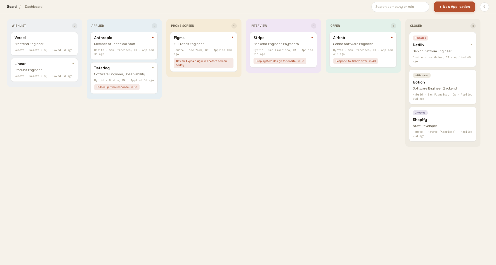
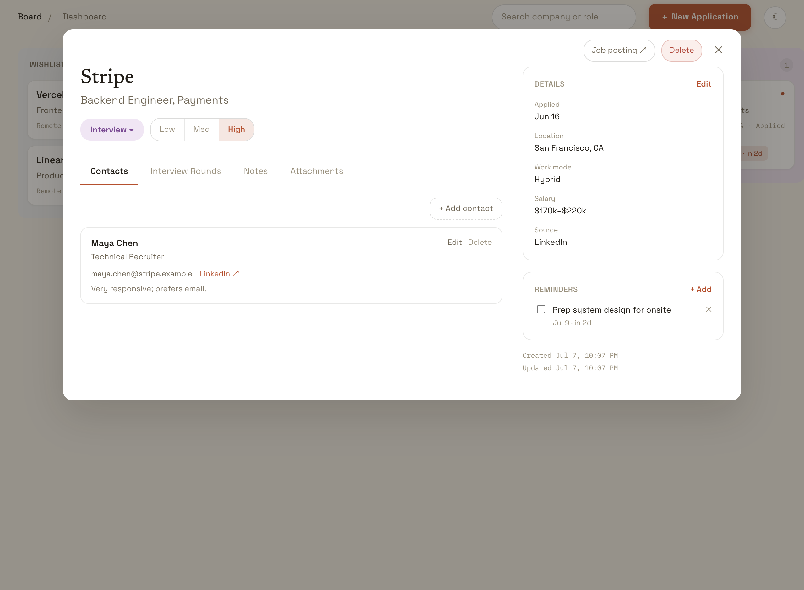
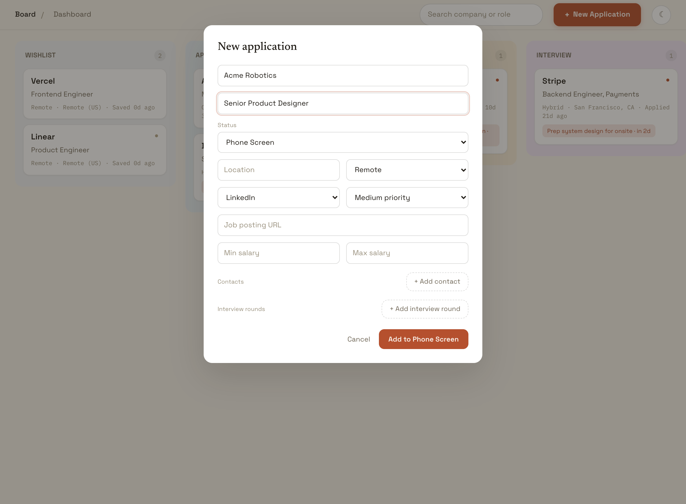
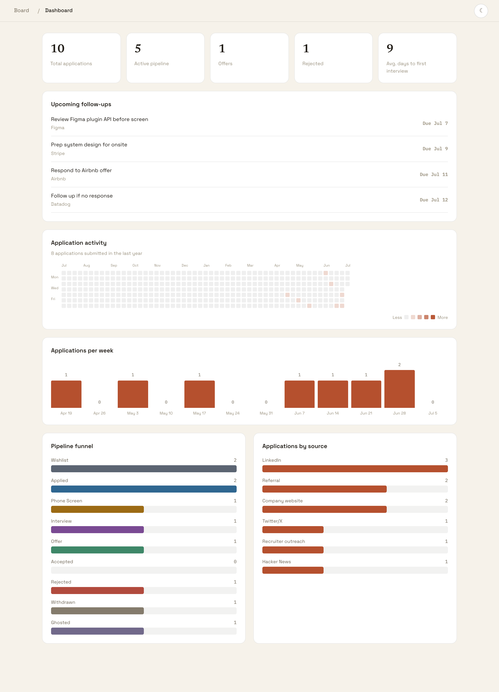
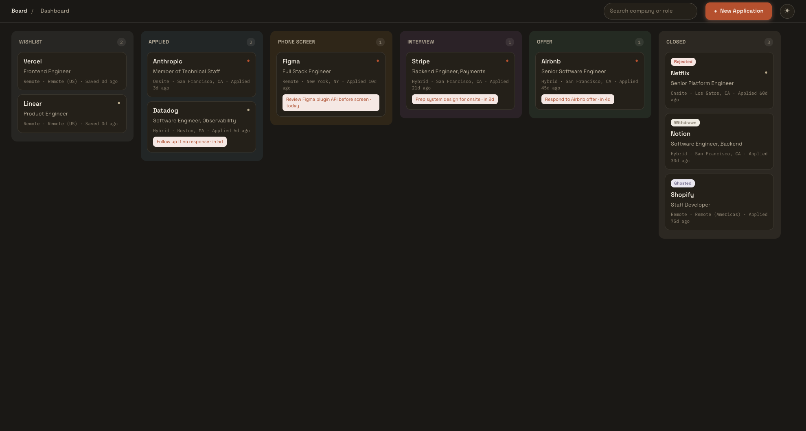

# Job Tracker

A single-user job application tracker that runs entirely on your machine.
Kanban pipeline with drag-and-drop (five active columns plus a grouped
Closed column), application details with contacts / interview rounds /
notes / reminders / file attachments, a stats dashboard with a GitHub-style
activity heatmap, light & dark themes, and CSV import/export via the API.
No accounts, no cloud — one SQLite file.

**Stack:** FastAPI + SQLAlchemy 2 + SQLite backend · React 19 + Vite +
TypeScript frontend · dnd-kit · pure-CSS charts.

The UI implements the "Job Tracker" design from the claude.ai/design
project `Job Application Tracker` (`Job Tracker.dc.html`); design tokens
live in `frontend/src/styles/tokens.css`.

## Quick start

```bash
./run.sh          # creates backend/.venv, installs deps, starts both servers
```

Then open http://localhost:5173. The API (with OpenAPI docs at
http://127.0.0.1:8000/docs) runs on port 8000; the Vite dev server proxies
`/api` to it.

Prefer make targets?

```bash
make setup        # venv + npm install
make dev          # same as ./run.sh
make seed         # load ~10 sample applications (ARGS=--force to wipe first)
make test         # backend (pytest) + frontend (vitest) suites
make serve        # single-process mode: build frontend, serve it from FastAPI on :8000
```

## Using the app

*Screenshots use the bundled sample data (`make seed`).*

### The board



The board is home. Six columns cover the pipeline: **Wishlist → Applied →
Phone Screen → Interview → Offer**, plus a **Closed** column that groups
the four terminal outcomes (each closed card carries its own tag —
Rejected, Withdrawn, Ghosted, Accepted).

- **Drag a card** to another column to change its status. Dropping on
  *Closed* asks which outcome it reached. Moving a card out of Wishlist
  stamps today as its applied date (unless one is already set).
- Each card shows work mode · location · *“Applied Nd ago”* (or *“Saved
  Nd ago”* before you apply), a priority dot (terracotta = high, tan =
  medium), and the next thing coming up — an overdue reminder in red,
  otherwise the earliest upcoming reminder or scheduled interview.
- **Search** (top right) filters by company or role as you type.
- **☾ / ☀** toggles dark mode; the choice sticks across sessions.
- **Board / Dashboard** in the top-left switches views.

### The application modal



Click any card (or open `/applications/<id>` directly — links survive
refresh) and the application opens as a modal over the board. Esc, the
✕, the backdrop, or the browser back button closes it.

- The **status pill** opens a grouped Active/Closed menu; the **Low /
  Med / High** control sets priority. Changes reflect on the board
  behind the modal immediately.
- Tabs: **Contacts** (add, edit, delete), **Interview Rounds** (type,
  schedule, interviewers, outcome), **Notes** (composer + inline
  editing), and **Attachments** (PDF/Word up to 10 MB, multi-file
  upload, click a row to download).
- The **Details** sidebar card edits everything else in one save:
  applied date, location, work mode, salary range + currency, source,
  job posting URL. **Reminders** live below it — add with a due date,
  check off, or delete.
- **Delete** (top right) removes the application and everything in it,
  after a confirmation.

### Adding an application



**+ New Application** opens the quick-add form. Company and role are
required; status defaults to **Applied** (stamping today as the applied
date — pick Wishlist to save without one). You can attach **contacts**
right away, and choosing *Phone Screen* or *Interview* status unlocks
adding **interview rounds** before the application even exists. Creating
drops you straight into the application modal.

### The dashboard



Stats at a glance: totals, active pipeline, offers, rejections, and
average days to first interview. **Upcoming follow-ups** lists undone
reminders due in the next two weeks (overdue first — click a row to jump
to its application). Below: a GitHub-style **activity heatmap** of
applications per day over the last year, applications per week, the
pipeline funnel, and applications by source.

### Dark mode



## Where your data lives

| What | Where |
|---|---|
| Database | `tracker.db` at the repo root (SQLite, one file) |
| Uploaded files | `uploads/<application id>/` |

Both are gitignored — they're personal data and never belong in the repo.
Back them up by copying the two paths.

The schema is created automatically on startup (`create_all`). There are no
migrations: this is a greenfield single-user app with a disposable local
database, so Alembic would add ceremony without benefit. If the schema
evolves later, introduce Alembic with a baseline autogenerate revision.

## Development notes

- Backend code is in `backend/app/` (routers → services → models); tests in
  `backend/tests/` run against an in-memory SQLite and a temp uploads dir.
- Frontend code is in `frontend/src/`; component tests mock the API client.
- Everything works offline. CORS is open only to the Vite dev origin.
- Python deps are pinned in `backend/requirements.txt` and installed into
  `backend/.venv` — never globally.

## Frontend redesign plan — match `Job Tracker.dc.html`

> **Status: implemented** (July 2026). The plan below is kept as the
> record of what was built and why. CSV import/export survives as API
> endpoints only (`/api/export/csv`, `/api/import/csv`). Follow-up
> change: the detail view opens as a modal over the board rather than a
> separate page — `/applications/:id` still deep-links (it renders the
> board with the modal open), and the back button closes it.

**Design source:** the claude.ai/design project “Job Application Tracker”
(`ba324b28-3e34-4556-92d3-e7aeb3a52ed6`), file `Job Tracker.dc.html`
(imported 2026-07-07). The prototype is the visual spec — match its output,
not its internals. It defines three views (Board, Dashboard, Detail with
deep links), a light/dark theme, a terracotta accent (`#B5502E`), and
Space Grotesk / Newsreader / IBM Plex Mono typography. Design-tool knobs
are implemented at their defaults: comfortable card density, grouped
“Closed” board column. Decisions already made: adopt the design’s
dashboard (pure-CSS charts + activity heatmap, drop recharts); drop the
CSV panel from the UI but keep `/api/export/csv` and `/api/import/csv`.

### Phase 0 — design foundations

1. Swap fonts: remove `@fontsource-variable/bricolage-grotesque` and
   `inter`; add Space Grotesk (variable), Newsreader (variable + italic),
   and IBM Plex Mono (400/500/600) from Fontsource — self-hosted, offline.
2. Rewrite `styles/tokens.css` as CSS variables copied from the design’s
   `THEME_TOKENS`: light (`--bg #F6F2EA`, `--surface #FFFFFF`,
   `--surface-alt`, `--column-bg`, `--text #211D17`, `--text-muted`,
   `--text-faint`, borders, `--overlay`, `--tint-weak`, `--disabled-bg`)
   and dark (`--bg #1A1815`, `--surface #242019`, …) under
   `[data-theme="dark"]`; plus `--accent #B5502E` (hover `#9C4325`) and
   the nine status fg/bg pairs (wishlist `#5B6472/#EEF0F2` … ghosted
   `#71698A/#EAE7F0`), outcome badge colors, and priority colors
   (medium dot `#B8AA8C`).
3. Add a `useTheme` hook: sets `data-theme` + `color-scheme` on `<html>`,
   persists to localStorage (`job-tracker-ui-prefs-v1`), defaults to
   light; round ☾/☀ toggle button rendered in every top bar.
4. Rewrite `styles/global.css` base: Space Grotesk body, 8px scrollbars,
   accent links, focus outline `2px solid rgba(181,80,46,0.25)`,
   placeholder color, `toastRise` keyframes.

### Phase 1 — backend additions (small)

5. Extend `GET /api/stats` with `applications_per_day`: `{date, count}`
   for the last 371 days (53 weeks ending today) from `applied_date`,
   zero-filled client-side. The heatmap and the 12-week bar chart both
   derive from it. Add tests.
6. Match the design’s response-time stat: exclude negative deltas
   (first interview scheduled before the applied date) from
   `avg_response_time_days`. Adjust the stats test.
7. Broaden the applied-date rule in `apply_status_change`
   (backend/app/routers/applications.py): stamp `applied_date` when
   moving out of wishlist to **any** status (not just `applied`) if it is
   unset — the design does this on every board drop and status change.
   Update transition tests.
8. No other API changes: contact/note/interview PATCH endpoints already
   exist for the new edit UIs; attachment upload already defaults
   `file_type` to `other` (the design has no category picker — the badge
   shows the filename extension, computed client-side); multi-file upload
   is sequential POSTs; `GET /api/reminders?upcoming=true&days=14`
   already returns overdue + next-two-weeks for the dashboard.

### Phase 2 — app shell, routing, shared UI

9. Replace the current topbar with the design’s 56px per-view bars:
   `Board / Dashboard` breadcrumb toggle, pill search input (board only),
   accent “+ New Application” button (hover lift + tinted shadow), theme
   toggle. Keep react-router paths — `/` (board), `/dashboard`,
   `/applications/:id` (equivalent of the prototype’s `#/a/{id}` deep
   links; the SPA fallback already survives refresh).
10. Shared UI: `ConfirmDialog` (replaces `window.confirm` for **all**
    deletes; the application variant warns that contacts, rounds, notes,
    reminders and attachments go with it) and `Toast` (bottom-center dark
    pill, ~2.6s auto-dismiss). Form validation keeps the existing inline
    `role="alert"` pattern; toasts surface transient/global feedback.

### Phase 3 — board

11. Rebuild the board with six columns: Wishlist, Applied, Phone Screen,
    Interview, Offer, and a grouped **Closed** column holding accepted /
    rejected / withdrawn / ghosted. Columns are 300px, tinted with the
    status bg (mixed toward the dark surface in dark mode), header =
    uppercase label + mono count badge; drag-over = accent border +
    accent-tint background.
12. Redesign cards: company 15px/600, role 13px muted, mono meta row
    “Remote · Location · Applied 3d ago” (or “Saved Nd ago” from
    `created_at` when no applied date), priority dot top-right (high =
    accent, medium = `#B8AA8C`, low = none), next-event chip (overdue
    reminder → red `Overdue — description`; else earliest of upcoming
    reminders / pending interviews → accent-tint chip), and a status tag
    on cards inside the Closed column. Sort within a column by
    `updated_at` desc (status order first inside Closed). Search filters
    client-side over company + role.
13. Keep @dnd-kit for drag & drop: dropping on a status column PATCHes
    `/status` optimistically (existing `moveCard`); dropping on Closed
    opens the outcome-picker modal (Accepted / Rejected / Withdrawn /
    Ghosted) and PATCHes on choice; dragged card at reduced opacity.
14. Rebuild the New Application modal per the design: company* / role*
    with a disabled “Add to {Status}” button until valid, status select
    with Active/Closed optgroups, location, work-mode / source / priority
    selects, job URL, salary min/max; sends `applied_date = today` when
    status ≠ wishlist; on create, navigate to the new detail page.

### Phase 4 — detail page

15. Rebuild `ApplicationDetailPage` as the design’s two-column layout
    (1fr / 320px sidebar, max-width 1120px): breadcrumb bar with
    “Job posting ↗” pill (safe URL via `lib/urls.toHttpUrl`) and a red
    Delete pill → ConfirmDialog; serif company (32px) + role; status pill
    opening the grouped dropdown menu (Active / Closed with colored
    dots); Low/Med/High segmented priority control.
16. Sidebar: Details card with a view list (Applied, Location, Work mode,
    Salary as `$95k–$115k`, Source) and an Edit mode that swaps to one
    form (job URL, applied date, location, work-mode select, salary
    min/max, currency select USD/EUR/GBP/CAD/AUD, source select) saved in
    a single PATCH — this replaces the per-field `InlineField` pattern.
    Below it: Reminders card (add form, checkbox toggle, overdue red /
    done struck) and a mono `Created … / Updated …` footer.
17. Tabs — Contacts / Interview Rounds / Notes / Attachments with accent
    underline: contacts gain an **Edit** flow (PATCH exists); rounds gain
    Edit with a type select mapped label⇄enum key (Phone Screen ⇄
    `phone_screen`, Technical, Onsite, Final, Other; legacy
    `behavioral`/`system_design` rows still render) and an outcome select
    + tinted badge; notes get inline editing (PATCH exists); attachments
    get multi-file upload, an extension badge (PDF/DOCX) derived from the
    filename, click-to-download, and confirmed deletes.

### Phase 5 — dashboard

18. Rebuild per the design, all pure CSS: five serif stat tiles;
    Upcoming follow-ups (overdue first, top 8, row click → detail);
    **activity heatmap** (53×7 grid from `applications_per_day`, five
    accent-tinted levels with dark-mode variants, month labels, per-day
    tooltips, “N applications submitted in the last year”); Applications
    per week (last 12 Sunday-start weeks, zero-filled, accent bars);
    Pipeline funnel (nine rows, status-colored bars); Applications by
    source (accent bars, sorted desc). Remove the CSV panel from the page.

### Phase 6 — cleanup & verification

19. Delete what the redesign obsoletes: recharts dependency,
    `chartTheme.ts`, the old chart components, `CsvPanel`, `Modal` /
    `InlineField` if fully replaced, the old font packages, and dead CSS.
20. Update tests and verify: board tests (six columns, closed tags,
    outcome-modal flow), detail tests (single-save edit form,
    contact/note/round editing, ConfirmDialog flows), dashboard smoke
    test (heatmap renders from stats), theme-toggle persistence; backend
    tests for `applications_per_day` and the broadened transition rule.
    Finish with `make test`, `npm run build`, and a `make serve` smoke
    check of all three views in both themes.
